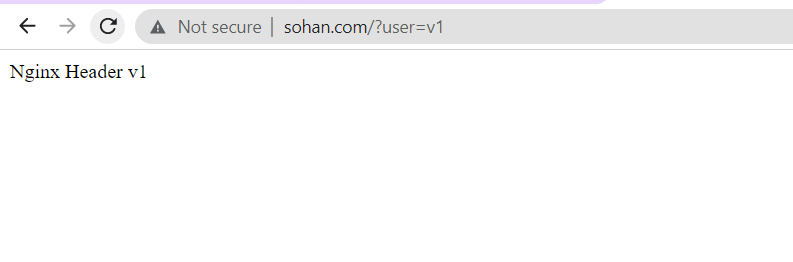
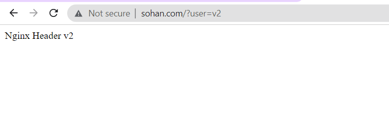
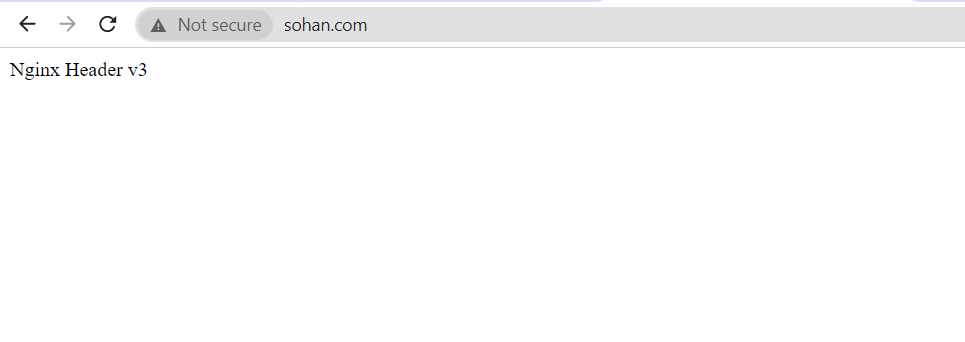
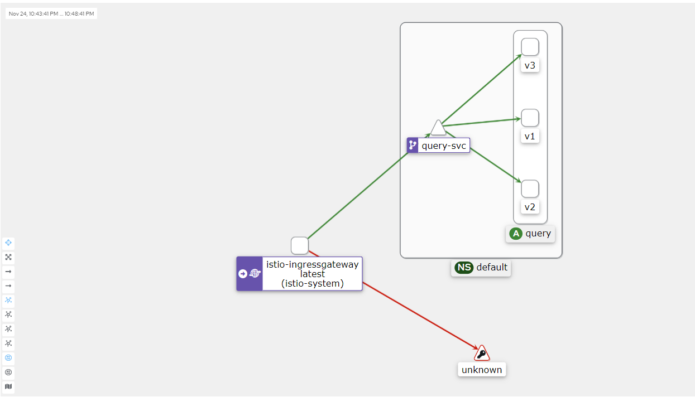

# Conculsion:
Once you have deployed the query based routing deployment using our manifest. Open the below url in browser

```
curl  http://sohan.com/?user=v1
```
## Output:


```
curl http://sohan.com/?user=v2
```
## Output:


```
curl http://sohan.com
```
## Output:


## Kiali DashBoard Output:

