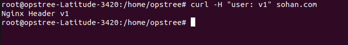
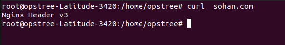

# Conculsion:
Once you have deployed the header based routing deployment using our manifest use the below command on linux or mac based OS.

```
curl -H "user: v1" sohan.com
```
## Output:


```
curl -H "user: v2" sohan.com
```
## Output:


```
curl sohan.com
```
## Output:


For Windows Based User. We can make use to chrome Extension [CLICK HERE](https://modheader.com/modheader)
